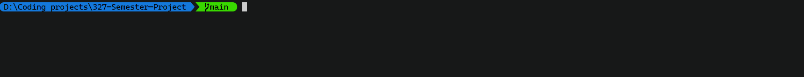
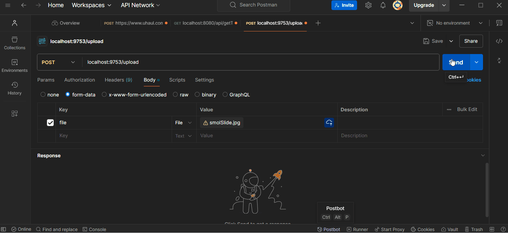
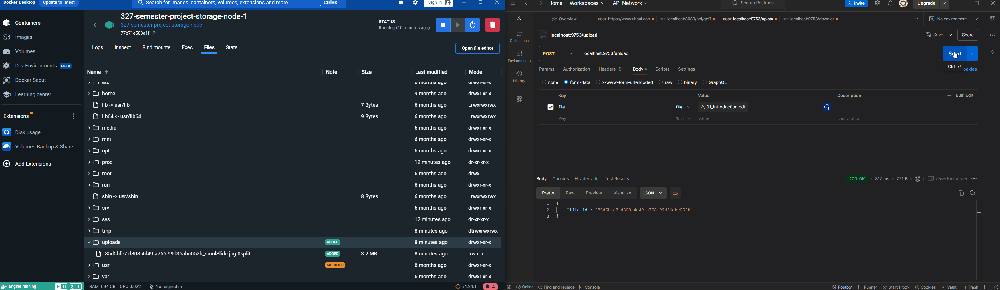

# Distributed Storage System

This project is a distributed storage system that allows clients to upload and download files. The system consists of a master node and multiple storage nodes.

## Project Structure

- Master Node: Handles client requests for file uploads and downloads. It splits the uploaded files into portions and distributes them across the storage nodes.
- Storage Nodes: Store the file portions received from the master node.

## Getting Started

### Prerequisites

- Docker
- Docker Compose

### Running the Project

 - `docker-compose up`
 - Upload a file to the endpoint `localhost:9753/upload` using a POST request with the file being in the request body. Key:Value is `file: <Your File>`. This will return an object with the file's UUID
 - Download your file with a GET request to `localhost:9753/download/<fileID>` where the ID is the UUID that was returned when uploaded. Don't lose that key!
 

## Demo
*Initializing the containers*

*Uploading an image file*

*File Splitting among storage nodes 1 and 3*

*Downloading a file*
